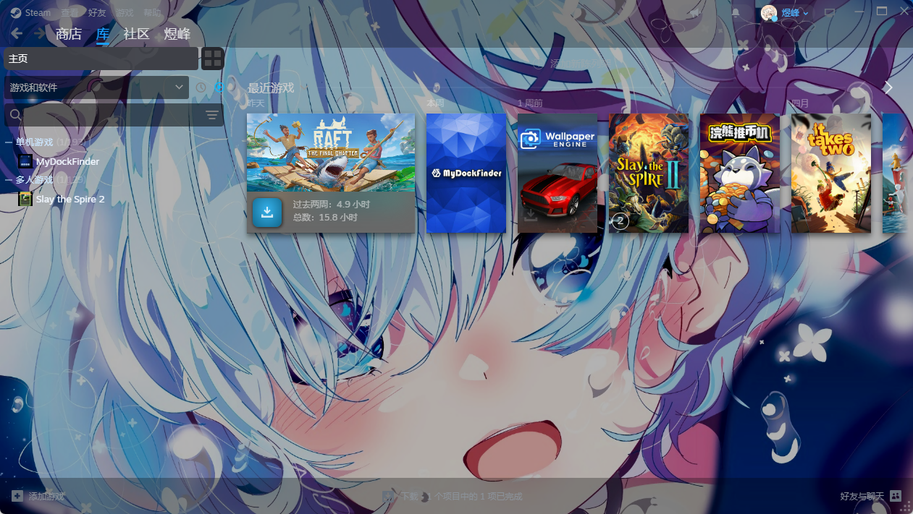

# Steam Leimu

[中文](README_CN.md)

A Steam skin based on the [Millennium](https://github.com/SteamClientHomebrew/Millennium) framework with Material Design 3 style.



## Features

- Rounded corner design
- Three corner radius options (Small/Medium/Large)
- Custom background images
- Covers all Steam UI: Library, Friends, Store, Menu, Notifications, Overlay

## Installation

1. Install [Millennium](https://github.com/SteamClientHomebrew/Millennium)
2. Place the skin folder into `steamui/skins/` directory
3. Select the skin in Millennium settings

## Custom Background

1. Run `skinTool.exe`
2. Select the background image you want to use
3. Restart Steam to apply changes

The skinTool supports both Chinese and English interfaces based on your system language.

## Project Structure

```
steam-leimu/
├── css/                    # CSS files
│   ├── libraryroot.custom.css
│   ├── friends.custom.css
│   ├── overlay.custom.css
│   ├── notifications.custom.css
│   ├── menu.custom.css
│   ├── webkit.css
│   └── radius-*.css       # Corner radius options
├── js/                     # JavaScript files
│   ├── libraryroot.custom.js
│   ├── friends.custom.js
│   └── bigpicture.custom.js
├── images/                 # Image assets
│   ├── main.jpg
│   ├── friends.jpg
│   ├── header.png
│   └── splash.png
├── skin.json              # Skin configuration
└── LICENSE                # MIT License
```

## License

This project is licensed under the MIT License - see the [LICENSE](LICENSE) file for details.

## Author

- **煜峰** - [yufengOvO](https://github.com/yufengOvO)
